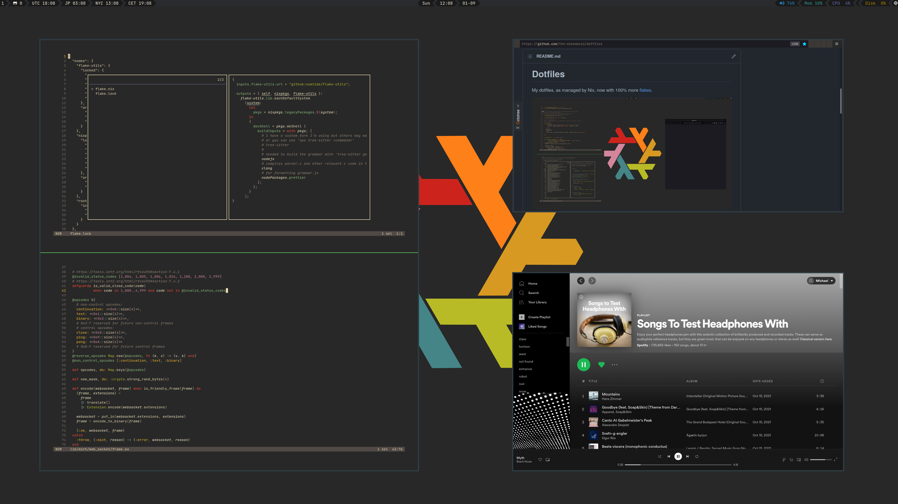

# Dotfiles

My dotfiles, as managed by Nix, now with 100% more
[flakes](https://nixos.wiki/wiki/Flakes).

## Setup

1. clone this repo somewhere on the machine
1. `sudo nixos-rebuild switch --flake path/to/this/repo#machinename`

Note that you must have one of my PGP private keys to decrypt secrets, so
this setup isn't directly usable for people who aren't me. You should be
able to use this repo as a reference to build your own configuration though
if you're interested in using flakes to manage all configuration.

## Repo structure

* `flake.nix` - the main configuration entrypoint for NixOS machines
    * the flake manifest imports configuration from all other nix expressions
      in the repo, such as `home.nix`
* `flake.lock` - lockfile for all flake dependencies, so that builds are
  reproducible across machines
* `users/michael.nix` - the [`home-manager`](https://github.com/nix-community/home-manager)
  configuration for my user on NixOS machines
    * this is where most of the configuration ends up, especially for user-space
      tools like `sway`, editors and browsers, etc.
    * documentation on all available options in home-manager can be found
      [here](https://nix-community.github.io/home-manager/options.html)
    * `users/root.nix` is much thinner, it's just git config for root
* `.git-crypt` and `.gitattributes` control which directories get encrypted
  by `git-crypt`, allowing me to host secrets in a public repo
* `defaults/` contains configuration on a per-program basis
    * these configurations are typically imported by `home.nix`
* `modules/common.nix` is common NixOS configuration shared between machines
* `machines/` contains directories for each NixOS machine I have with an overall
  machine-specific `configuration.nix` module and a hardware-specific
  `hardware-configuration.nix` module
    * `mango` is a custom-built desktop machine
* `colorschemes/` has program-specific color schemes setup as nix attribute
  sets
* `darwin/` darwin (MacOS) home-manager configuration

## Some specifics

* I have my root device setup to use `tmpfs`
    * see [this great guide](https://elis.nu/blog/2020/05/nixos-tmpfs-as-root/)
    * also see [the impermanence project](https://github.com/nix-community/impermanence)
      from the nix community
    * this forces me to explicitly control what data I want stored in
      non-volatile memory, which helps give confidence that my configuration
      is fully described by nix and is reproducible across machines
    * this also reveals some annoyances like browsers asking to be defaults,
      and forces you to go find the configuration switch to turn off annoying
      behavior
    * I also use the `home-manager` integration so I have to be specific about
      what persists across reboots for my user. See `users/michael.nix` for the
      commented list.
* Non-volatile memory (including swap spaces) are luks-encrypted
    * (`/boot` is not encrypted though)
    * I recommend [this gist](https://gist.github.com/martijnvermaat/76f2e24d0239470dd71050358b4d5134)
      as a guide
    * also see the [NixOS full disk encryption](https://nixos.wiki/wiki/Full_Disk_Encryption)
      wiki page
* I use [`sway`](https://github.com/swaywm/sway) as a window manager
    * Wayland support is actually not bad these days
    * I find Wayland more consistent and less buggy than X in my experience
* Gruvbox is almost 100% awesome
    * the sway configuration in this repository loads a gruvbox colored
      NixOS logo as a background and sets up kitty and GTK with gruvbox
    * I yak shave extensively on a gruvbox-descendant theme I tentatively
      call `grv`.
* I use Nix flakes
    * they're experimental and it's not clear when/if they will become stable
    * they help with reproducibility and working across machines
    * pretty much everything in [@nix-community](https://github.com/nix-community)
      supports flakes
    * see [the Flakes wiki page](https://nixos.wiki/wiki/Flakes) for more info
      about flakes

## Exceptions

Using the `nix profile` command to install flakes is imperative and not
reproducible across machines. I use it for anything I hack on, like
[helix](https://github.com/helix-editor/helix), where I'll make a fork,
add a `flake.nix` if it's missing, and install it into the profile,
making sure to push any branches of consequence.
